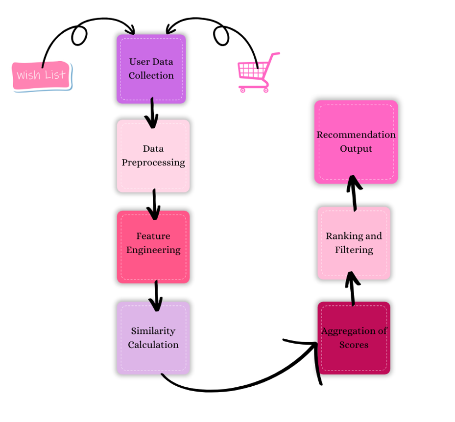

Myntra Recommend

In today's e-commerce landscape, customer expectations for interactive and personalised experiences are higher than ever. Our experience shows that sharing items with friends and family can be cumbersome, requiring users to copy links and use external apps like WhatsApp, disrupting the shopping flow. This lack of seamless integration for social interaction and personalized recommendations leads to a fragmented and less engaging shopping experience.

